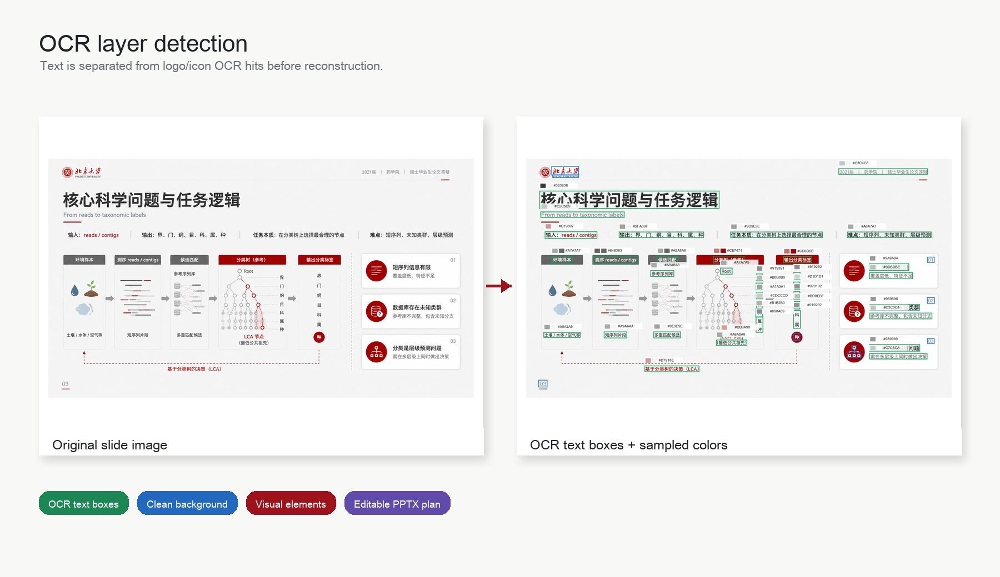
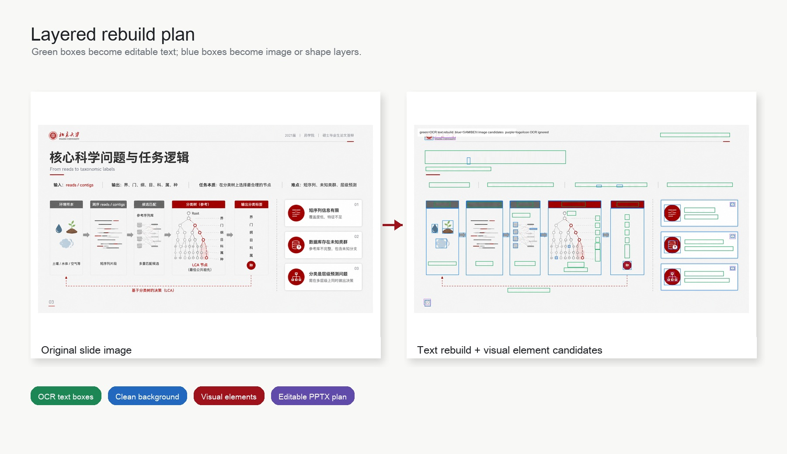
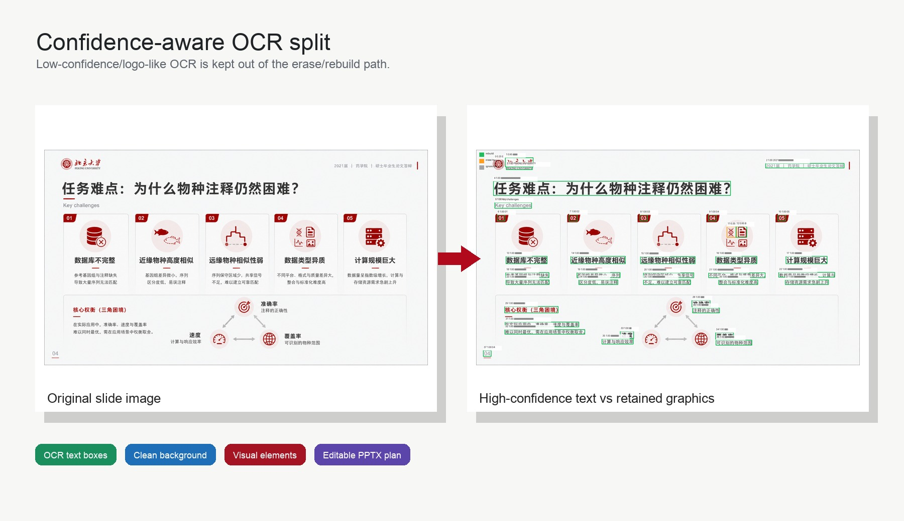
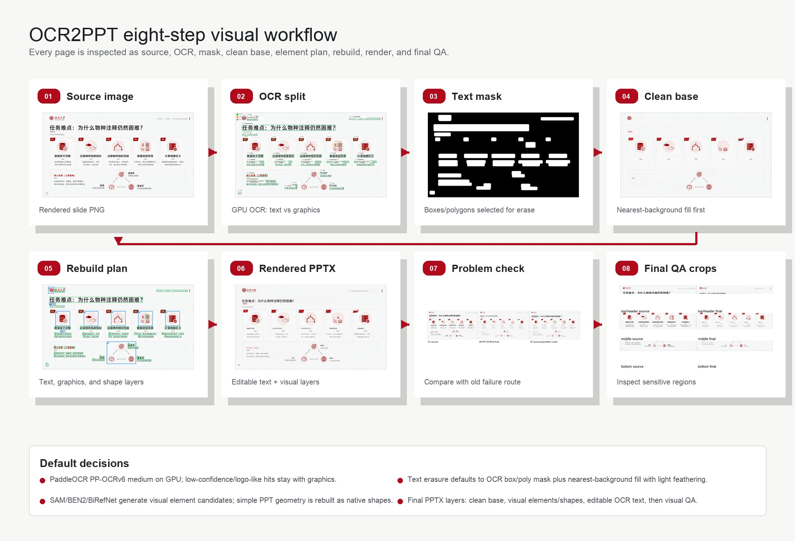

# OCR2PPT

OCR2PPT is a Codex skill for reconstructing editable PowerPoint decks from slide images. The core workflow treats a slide as layered content: OCR text, clean background, visual elements, native shapes, and a final editable PPTX rebuild.

## Visual Examples

### OCR Layer Detection

Original slide image on the left; OCR text/color sampling overlay on the right.

### Layered Rebuild Plan

Original slide image on the left; text rebuild boxes and visual element candidates on the right.

### Confidence-Aware OCR Split

Original slide image on the left; high-confidence text and retained graphics split on the right.

## Eight-Step Workflow

The default workflow generates step visualizations before claiming a better reconstruction path.

## Current Defaults

- OCR: PaddleOCR PP-OCRv6 medium on GPU.
- Text removal: OCR box/poly mask plus nearest-background fill with light feathering.
- Visual extraction: SAM/SAM2 candidates, with BEN2/BiRefNet as cutout alternatives.
- PPTX assembly: clean base, visual elements/native shapes, editable OCR text, visual QA.

See [SKILL.md](SKILL.md) for the operational workflow and GPU server notes.
